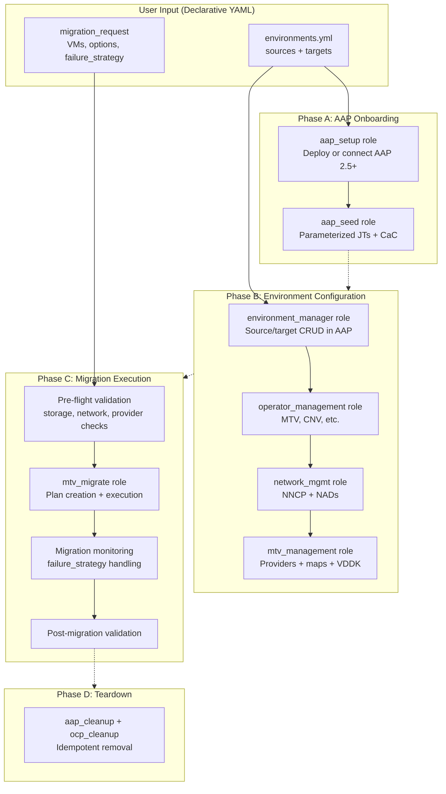

# Migration Factory v2 — Architecture Design

## 1. Design Principles

- **AAP 2.5+ only** — Drop AAP 2.4 support. Eliminates all version-branching code (`infra.controller_configuration` vs `infra.aap_configuration`, dual API paths, dual org variable names).
- **No bootstrap tier** — Remove the VM-based bootstrap AAP entirely. Users either deploy AAP on OCP directly or point to an existing instance.
- **Environments as data, not inventory groups** — Replace rigid `migration_hub`/`migration_spoke` groups with declarative YAML definitions of source and target environments.
- **Parameterized over materialized** — Replace the N x M combinatorial explosion of AAP job templates/workflows with a small set of parameterized job templates using survey variables.
- **Error handling everywhere** — `block`/`rescue`/`always` patterns in all roles, with configurable `failure_strategy` for migrations.
- **EE definition in-repo** — Include `execution-environment.yml` so the EE build is reproducible and versioned.

---

## 2. v1 to v2 Role Mapping

| v1 Role | v2 Fate | Rationale |
|---------|---------|-----------|
| `bootstrap` | **REMOVED** | Bootstrap AAP VM tier eliminated |
| `aap_deploy` | **MERGED** into `aap_setup` | Simplified to AAP 2.5+ only |
| `create_mf_aap_token` | **MERGED** into `aap_setup` | Token creation is a sub-task of setup |
| `aap_seed` | **REWRITTEN** | Parameterized JTs, no combinatorial explosion |
| `aap_cleanup` | **REWRITTEN** | AAP 2.5+ only, simplified dispatch |
| `aap_machine_credentials` | **DEFERRED** to Phase 3 | Day 2 scope |
| `mtv_management` | **REWRITTEN** | Error handling, provider lifecycle, `provider` var fix |
| `mtv_migrate` | **REWRITTEN** | `failure_strategy`, pre-flight, scheduling, cold migration |
| `network_mgmt` | **REWRITTEN** | Bug fixes (typo), error handling, OVN/UDN prep |
| `validate_migration` | **ENHANCED** | Structured output, pre-flight integration |
| `cluster_healthcheck` | **ENHANCED** | Additional checks for v2 readiness |
| `operator_management` | **SIMPLIFIED** | Fewer defaults, cleaner config |
| `ocp_cleanup` | **KEPT** | Enhanced scoping |
| `vm_networking` | **REMOVED** | Already deprecated |
| `vm_lifecycle`, `vm_hot_plug`, `vm_mac_address`, `vm_ssh`, `vm_collect` | **REMOVED** | Belong in `openshift_virtualization_ops` collection |
| `vm_backup_restore`, `vm_patching` | **DEFERRED** to Phase 3 | Day 2 scope |

**New roles:**

- `aap_setup` — Consolidated AAP deployment + connection + token creation
- `environment_manager` — CRUD for source/target environment definitions in AAP

---

## 3. v2 High-Level Architecture



---

## 4. Environment Data Model

The core architectural change: environments are **data structures**, not inventory groups. A single YAML file defines all sources and targets. This file is consumed by `aap_seed` (to create AAP resources) and by migration playbooks (to resolve providers/maps).

```yaml
# Example: environments.yml
migration_factory:
  sources:
    - name: vcenter-prod
      type: vmware
      host: vcenter.prod.example.com
      sdk_endpoint: /sdk
      credentials:
        username: svc-migration@vsphere.local
        password: "{{ vault_vcenter_prod_password }}"
      insecure_skip_tls_verify: false
      certificate: "{{ vault_vcenter_prod_cert }}"
      vddk:
        image: registry.example.com/vddk:8.0
        registry_credentials:
          username: "{{ vault_registry_user }}"
          password: "{{ vault_registry_pass }}"
      esxi_hosts: []  # optional, for ESXi-direct mode (MTV-06)

    - name: rhv-legacy
      type: ovirt
      host: rhvm.example.com
      sdk_endpoint: /ovirt-engine/api
      credentials:
        username: admin@internal
        password: "{{ vault_rhv_password }}"

  targets:
    - name: ocp-prod-east
      host: https://api.ocp-prod-east.example.com:6443
      credentials:
        api_key: "{{ vault_ocp_east_token }}"
        # OR: username/password for token generation
      mtv_namespace: openshift-mtv
      default_target_namespace: vm-workloads
      operators:  # override default operator list per target
        - mtv
        - cnv
        - nmstate

    - name: ocp-staging
      host: https://api.ocp-staging.example.com:6443
      credentials:
        api_key: "{{ vault_ocp_staging_token }}"
      mtv_namespace: openshift-mtv
      default_target_namespace: vm-staging
```

**Key design decisions:**

- Sources and targets are **independent lists** — any source can be linked to any target at migration time
- Credentials are stored in AAP credential store (custom credential types inject them), never in playbook vars at runtime
- The `type` field on sources drives provider logic (replaces the implicit `provider` extra var that was undeclared in v1)
- Each target can override its operator list (replaces `aap_seed_operator_management_hub/spoke` split)

---

## 5. AAP Content Model (v2)

### v1 Problem: Combinatorial Explosion

v1 generates: `(hosts) x (targets) x (5 JT types) + (hosts) x (target workflows) + aggregate workflows`

For 3 spokes with 2 targets each = **30+ job templates, 12+ workflows**.

### v2 Solution: Parameterized Job Templates

v2 seeds a **fixed set of job templates** regardless of environment count:

| Job Template | Playbook | Survey Parameters | Purpose |
|---|---|---|---|
| MF - Configure Operators | `configure_operators.yml` | `target_name` | Install operators on a target cluster |
| MF - Configure Networking | `configure_networking.yml` | `target_name`, `source_name` | Set up NNCP/NADs for a source-target pair |
| MF - Configure MTV | `configure_mtv.yml` | `target_name`, `source_name` | Providers, maps, VDDK for a source-target pair |
| MF - Configure Environment | `configure_environment.yml` | `target_name`, `source_name` | Full env setup (operators + networking + MTV) |
| MF - Migrate | `migrate.yml` | `target_name`, `source_name`, `migration_request` | Execute migration with full lifecycle |
| MF - Validate | `validate.yml` | `target_name`, mode | Pre or post migration validation |
| MF - Healthcheck | `healthcheck.yml` | `target_name` | Cluster health check |
| MF - Teardown | `teardown.yml` | `target_name`, scope | Remove MF content |
| MF - Seed AAP | `seed_aap.yml` | — | Re-run CaC seeding |

**Total: 9 job templates** (fixed), regardless of how many environments exist.

### Workflow Templates

One primary orchestration workflow:

```
MF - Full Migration Workflow
├── MF - Configure Environment (source + target)
├── MF - Validate (pre-flight)
├── MF - Migrate
└── MF - Validate (post-migration)
```

Users can compose custom workflows from the parameterized JTs for their specific patterns.

### Credential Types (v2)

Replace the three v1 custom types with two cleaner types:

| Credential Type | Fields | Injected As |
|---|---|---|
| `Migration Factory - Source Environment` | type, host, sdk_endpoint, username, password, certificate, vddk_image | Extra vars (`mf_source_*`) |
| `Migration Factory - Target Cluster` | host, api_key, mtv_namespace, default_target_namespace | Extra vars (`mf_target_*`) + env vars (`K8S_AUTH_*`) |

The v1 `openshift_virtualization_migration_cac` type (which bundled AAP config + migration targets into one credential) is eliminated. AAP connection details are handled natively by AAP (machine credentials), and environment details are handled by the two types above.

---

## 6. Role Designs

### `aap_setup` (NEW — consolidates `bootstrap` + `aap_deploy` + `create_mf_aap_token`)

**Purpose:** AAP-01 (connect existing) + AAP-02 (deploy on OCP) + token generation.

```yaml
# defaults/main.yml
aap_setup_mode: connect          # connect | deploy
aap_setup_controller_host: ""
aap_setup_controller_username: admin
aap_setup_controller_password: ""
aap_setup_controller_token: ""
aap_setup_validate_certs: true

# Deploy mode only
aap_setup_openshift_host: ""
aap_setup_openshift_api_key: ""
aap_setup_aap_channel: stable-2.5
aap_setup_aap_instance_name: migration-factory
aap_setup_aap_namespace: aap
aap_setup_generate_token: true   # auto-create SA + token for AAP
```

**Task flow:**

1. `connect.yml` — validate AAP connectivity (API health check)
2. `deploy.yml` — (deploy mode) install AAP operator on OCP via `infra.aap_utilities.aap_ocp_install`, wait for readiness, extract admin password
3. `token.yml` — (if `generate_token`) create ServiceAccount + ClusterRoleBinding, extract token
4. `always` — set `aap_setup_controller_*` facts for downstream roles

**Error handling:** `block`/`rescue` on deployment with rollback guidance. Assert API reachable before returning.

### `aap_seed` (REWRITTEN)

**Purpose:** AAP-03 (CaC via `infra.aap_configuration`) + AAP-04 (minimum content).

**Key change:** No more dynamic JT/workflow generation from inventory. Seeds the fixed parameterized JT set from Section 5.

```yaml
# defaults/main.yml
aap_seed_org_name: Migration Factory
aap_seed_project_repo: ""
aap_seed_project_branch: main
aap_seed_ee_image: ""
aap_seed_environments: {}         # the environments.yml data structure

# Toggles
aap_seed_create_organization: true
aap_seed_create_project: true
aap_seed_create_ee: true
aap_seed_create_credential_types: true
aap_seed_create_credentials: true
aap_seed_create_inventories: true
aap_seed_create_job_templates: true
aap_seed_create_workflows: true
```

**Task flow:**

1. Build credential type definitions (2 custom types)
2. Build credentials from `aap_seed_environments` (one per source + one per target)
3. Build fixed JT list with survey specs
4. Build workflow template
5. Dispatch via `infra.aap_configuration.dispatch`

**The `environments` data drives credential creation**, but JTs are static templates — no loops over hosts x targets.

### `environment_manager` (NEW)

**Purpose:** TEM-01 through TEM-04 — CRUD for environments in AAP.

```yaml
# defaults/main.yml
environment_manager_state: present       # present | absent
environment_manager_environments: {}     # same structure as environments.yml
```

**Task flow:**

- `present`: For each source/target, ensure AAP credential + inventory host exists
- `absent`: Remove AAP credentials + inventory hosts for specified environments
- Validate connectivity to each target cluster (TEM-05 readiness check)
- Idempotent — re-running with same data is a no-op

### `mtv_migrate` (REWRITTEN)

**Purpose:** MIG-01 through MIG-09 — the core migration engine.

**New capabilities:**

- `failure_strategy` parameter (MIG-05)
- Pre-flight validation (MIG-08)
- Cold migration with shutdown/timeout (MIG-07)
- Maintenance window scheduling (MIG-09)
- Structured migration report output

```yaml
# defaults/main.yml (key new variables)
mtv_migrate_failure_strategy: continue_and_report
    # continue_and_report | continue_and_retry | halt_on_failure
mtv_migrate_max_retries: 3
mtv_migrate_pre_flight: true
mtv_migrate_shutdown_timeout: 300
mtv_migrate_force_shutdown: false
mtv_migrate_cleanup_source: false
mtv_migrate_scheduled_start: ""           # ISO 8601
mtv_migrate_maintenance_window_end: ""    # ISO 8601
```

**Task flow with error handling:**

```yaml
# tasks/main.yml (conceptual structure)
- block:
    - name: Pre-flight validation
      include_tasks: _pre_flight.yml
      when: mtv_migrate_pre_flight

    - name: Wait for maintenance window
      include_tasks: _schedule.yml
      when: mtv_migrate_scheduled_start | length > 0

    - name: Build migration plans
      include_tasks: _plans.yml

    - name: Execute migrations
      include_tasks: _execute.yml

  rescue:
    - name: Capture failure context
      include_tasks: _capture_failure.yml

    - name: Apply failure strategy
      include_tasks: _failure_strategy.yml

  always:
    - name: Generate migration report
      include_tasks: _report.yml
      # Report: VM name, source, failure reason, timestamp, plan name
```

**Failure strategy implementation (`_execute.yml`):**

```yaml
# For split plans, process each plan batch:
- name: Execute plan batch
  include_tasks: _execute_plan.yml
  loop: "{{ _plan_batches }}"
  loop_control:
    loop_var: _current_plan
  register: _plan_results

# _execute_plan.yml uses block/rescue per plan:
- block:
    - name: Create Plan CR
    - name: Wait for Plan Ready
    - name: Create Migration CR
    - name: Monitor migration progress
  rescue:
    - name: Record failure
      set_fact:
        _failed_plans: "{{ _failed_plans + [_failure_record] }}"
    - name: Halt if strategy requires
      fail:
        msg: "{{ _failure_record }}"
      when: mtv_migrate_failure_strategy == 'halt_on_failure'
    - name: Queue retry if strategy requires
      set_fact:
        _retry_queue: "{{ _retry_queue + [_current_plan] }}"
      when: mtv_migrate_failure_strategy == 'continue_and_retry'
```

### `mtv_management` (REWRITTEN)

**Key fixes:**

- Declare `provider` variable in defaults (derived from source type)
- Add `block`/`rescue` to inventory query, provider creation, map creation
- Fix `_mtv_provider_vmware.yml` namespace bug (copy-paste from NAD field)
- Structured error output on provider/map failures

### `network_mgmt` (REWRITTEN)

**Key fixes:**

- Fix `network_mgmt_portgrous_to_migrate` typo (to `network_mgmt_portgroups_to_migrate`)
- Add `block`/`rescue` to NNCP and NAD creation
- Add retry logic for `k8s` apply operations
- Add validation that NNCPs reach `Available` before creating NADs

---

## 7. Playbook Structure (v2)

```
playbooks/
├── setup_aap.yml                    # Phase A: Deploy or connect AAP
├── seed_aap.yml                     # Phase A: Populate AAP with CaC
├── configure_environment.yml        # Phase B: Full env setup (operators + net + MTV)
├── configure_operators.yml          # Phase B: Install operators on target
├── configure_networking.yml         # Phase B: NNCP + NADs
├── configure_mtv.yml                # Phase B: Providers + maps + VDDK
├── migrate.yml                      # Phase C: Execute migration
├── validate.yml                     # Phase C: Pre/post validation
├── healthcheck.yml                  # Cluster health check
├── teardown.yml                     # Phase D: Remove MF content
└── vars/
    └── (no more bootstrap CaC vars)
```

Each playbook runs on `localhost` with `connection: local` and sources cluster credentials from AAP credentials or extra vars. No more `migration_hub`/`migration_spoke`/`migration_aap` host groups.

---

## 8. Dependency Chain (v2)

```yaml
# galaxy.yml dependencies (simplified)
dependencies:
  redhat.openshift_virtualization: ">=2.1.0"
  redhat.openshift: ">=4.0.0"
  vmware.vmware_rest: ">=4.6.0"
  kubernetes.core: ">=5.2.0"
  ansible.controller: ">=4.6.0"       # AAP 2.5+ only
  infra.aap_configuration: ">=3.4.1"  # No longer commented out
  infra.aap_utilities: ">=2.6.0"
  community.crypto: ">=2.26.0"
  community.general: ">=10.5.0"
  community.vmware: ">=5.5.0"
  ansible.posix: ">=1.6.2"
  ansible.utils: ">=6.0.0"
```

**Removed:**

- `infra.controller_configuration` (AAP 2.4 support dropped)
- `ansible.platform` reference (not needed when `ansible.controller >= 4.6.0`)

**`infra.aap_configuration` is now a hard dependency** — no longer conditionally selected at runtime.

---

## 9. Execution Environment (In-Repo)

```yaml
# extensions/ee/execution-environment.yml (NEW)
version: 3
images:
  base_image:
    name: registry.redhat.io/ansible-automation-platform/ee-minimal-rhel9:latest

dependencies:
  galaxy: requirements.yml    # points to galaxy.yml deps
  python:
    - kubernetes
    - requests
    - pyVmomi
  system: []

additional_build_steps:
  append_final:
    - RUN pip install --no-cache-dir jmespath
```

---

## 10. Testing Strategy (v2)

| Level | Tool | Coverage Target | Phase |
|---|---|---|---|
| Unit | `ansible-test units` + `pytest` | Filter plugins, custom modules | Phase 1 |
| Sanity | `ansible-test sanity` | All roles, playbooks, plugins | Phase 1 |
| Lint | `ansible-lint --profile production` | Zero violations | Phase 1 |
| Role integration | Molecule | Core roles: `aap_seed`, `aap_cleanup`, `mtv_management`, `mtv_migrate` | Phase 1 |
| E2E | Molecule + live infra | Full VMware to OCP migration | Phase 2 |
| Documentation | CI check | All roles have generated READMEs | Phase 1 |

**Molecule scenario per core role** with mock k8s API (using `kubernetes.core` test fixtures or mocked `k8s_info` responses).

---

## 11. v1 to v2 Migration Path (DOC-03)

| v1 Concept | v2 Equivalent |
|---|---|
| `migration_hub` inventory group | `environments.targets[*]` with `operators` override |
| `migration_spoke` inventory group | `environments.targets[*]` (all targets are peers) |
| `migration_targets` group var | `environments.sources[*]` |
| `configured_migration_targets` per host | Source-target linking at migration time (survey params) |
| `bootstrap` inventory group | Removed — use `aap_setup_mode: deploy` |
| `bootstrap_cac` credential type | Removed |
| `openshift_virtualization_migration_cac` credential type | `Migration Factory - Source Environment` + `Migration Factory - Target Cluster` |
| Per-host job templates | Single parameterized JT per action |
| Per-target workflow nodes | Single parameterized workflow |

**Coexistence:** v2 uses `mf2_` prefix on all AAP resources (per PRD upgrade requirements). v1 and v2 resources can coexist on the same AAP instance. v2 teardown only removes `mf2_`-prefixed resources.

---

## 12. Directory Structure (Final)

```
infra.openshift_virtualization_migration/
├── galaxy.yml
├── meta/runtime.yml
├── README.md
├── CHANGELOG.md
├── CONTRIBUTING.md
├── roles/
│   ├── aap_setup/
│   │   ├── tasks/
│   │   │   ├── main.yml
│   │   │   ├── connect.yml
│   │   │   ├── deploy.yml
│   │   │   └── token.yml
│   │   ├── defaults/main.yml
│   │   └── meta/main.yml
│   ├── aap_seed/
│   │   ├── tasks/
│   │   │   ├── main.yml
│   │   │   ├── credentials.yml
│   │   │   ├── job_templates.yml
│   │   │   └── workflows.yml
│   │   ├── defaults/main.yml
│   │   ├── templates/
│   │   │   ├── survey_migrate.yml.j2
│   │   │   └── survey_configure.yml.j2
│   │   └── meta/main.yml
│   ├── aap_cleanup/
│   ├── environment_manager/
│   ├── operator_management/
│   ├── network_mgmt/
│   ├── mtv_management/
│   ├── mtv_migrate/
│   │   ├── tasks/
│   │   │   ├── main.yml
│   │   │   ├── _pre_flight.yml
│   │   │   ├── _schedule.yml
│   │   │   ├── _plans.yml
│   │   │   ├── _execute.yml
│   │   │   ├── _execute_plan.yml
│   │   │   ├── _monitor.yml
│   │   │   ├── _failure_strategy.yml
│   │   │   ├── _capture_failure.yml
│   │   │   └── _report.yml
│   │   ├── defaults/main.yml
│   │   ├── templates/
│   │   └── meta/main.yml
│   ├── validate_migration/
│   └── cluster_healthcheck/
├── playbooks/
│   ├── setup_aap.yml
│   ├── seed_aap.yml
│   ├── configure_environment.yml
│   ├── configure_operators.yml
│   ├── configure_networking.yml
│   ├── configure_mtv.yml
│   ├── migrate.yml
│   ├── validate.yml
│   ├── healthcheck.yml
│   └── teardown.yml
├── plugins/
│   ├── filter/rfc1123.py
│   └── modules/
├── tests/
│   ├── unit/plugins/filter/test_rfc1123.py
│   ├── integration/targets/
│   └── config.yml
├── extensions/
│   ├── molecule/
│   └── ee/execution-environment.yml
├── docs/
│   ├── quickstart.md
│   ├── architecture.md
│   └── v1-to-v2-migration.md
└── .github/workflows/
```
